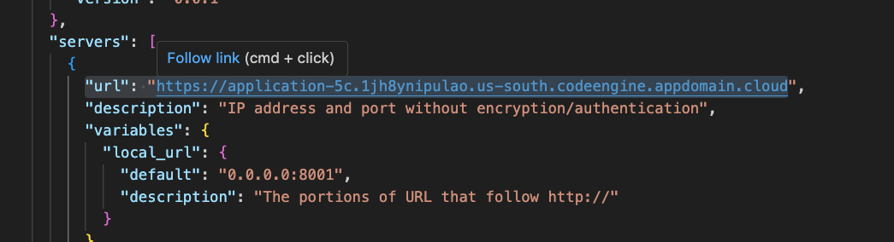
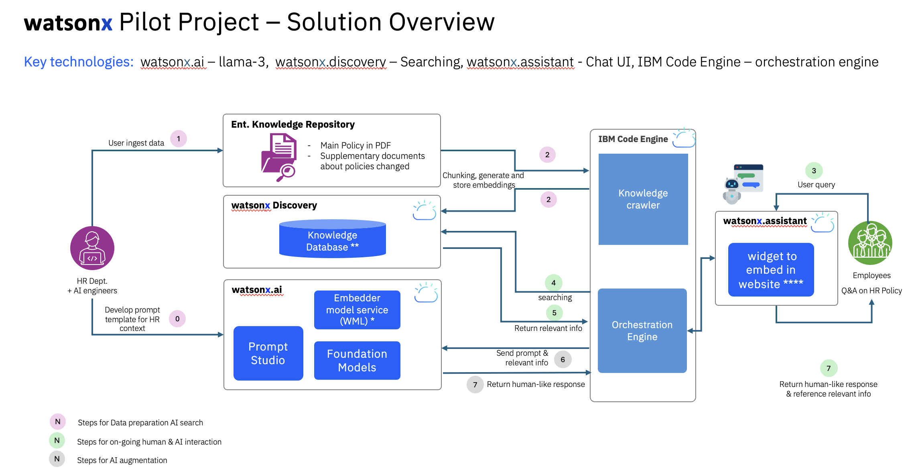
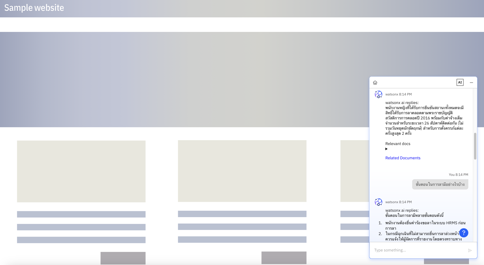

# Instructions
## Steps 0. PRE-REQUISITES

Fill in the environment variables following the `env-template.txt`

**Embedder model deployment**

CODE: https://github.com/edsml-kl121/wml-machine-learning-deployments
<br>
BLOG: https://medium.com/@mewleenutaphong/deploying-your-own-embedder-model-on-watsonx-platform-using-watson-machine-learning-408caef08f64
<br>
and get the credentials for embedder `emb_ibm_cloud_url`, `emb_api_key`, `emb_space_id`, `deployment_id` by following above guide.

**Elasticsearch/watsonx discovery setup**
Get the watsonx discovery instance provisioned noting down the `es_endpoint`
and `es_cert_path` by going through the following code.
<br>
CODE: https://github.com/edsml-kl121/get-started-with-watsonx-discovery
<br>

**watsonx.ai LLM inferencing setup**
To get credentials for LLM watsonx ai inferencing, follow this instruction
<br>https://github.com/edsml-kl121/compact-watsonx-ai-incubation-program/blob/main/TH/lab_0_laptop_environment_setup/lab-0-environment-test.ipynb 
<br>
to get `WATSONX_APIKEY`, `WATSONX_PROJECT_ID`, `IBM_CLOUD_URL`

**Note**: depending on how you deploy `WATSONX_APIKEY` can equal `emb_api_key` and `IBM_CLOUD_URL` can equal `emb_ibm_cloud_url`. If you decide to deploy them in the same IBM cloud project.

Install required dependencies
```
conda create --name fast-watsonx python=3.11
conda activate fast-watsonx
pip install -r requirement.txt
```

## Steps 1. EXTRACTION

Go to extraction.ipynb and run the notebook. This will generate chunks along with page number.

## Steps 2. INGESTION

run the `ingestion.py` file (Be sure to add your `cert.pem` into this INGESTION folder)

## Steps 3. Deploying backend to IBM Code Engine

Do `python app.py` (Be sure to add your `cert.pem` into this BE folder)

test it is working with
```
curl -X POST http://127.0.0.1:8001/generation_stream -H "Content-Type: application/json" -d '{"input": "Give me the leave days"}'

curl -X POST http://127.0.0.1:8001/finding_documents -H "Content-Type: application/json" -d '{"user_query": "Give me the leave days"}'

curl -X POST http://127.0.0.1:8001/get_upcoming_holidays -H "Content-Type: application/json" -d '{"user_query": "Give me the total revenue for the year"}'

curl -X POST http://127.0.0.1:8001/get_leave_days -H "Content-Type: application/json" -d '{"user_query": "Give me the total revenue for the year"}'
```

Please install podman/docker and push your image to dockerhub/ibm container registry

```
podman buildx build --platform linux/amd64 -t watsonx-full-stack-v2 .
podman tag watsonx-full-stack-v2 u1800085/watsonx-full-stack-v2:latest
podman push u1800085/watsonx-full-stack-v2:latest
```

can check if it is functioning correctly before deployment with
```
podman run -p 8001:8001 watsonx-full-stack-v2
```

Get the new URL from IBM Code Engine and test it (Example below but modify with your updated url/endpoint)

```
curl -X POST https://application-5c.1jh8ynipulao.us-south.codeengine.appdomain.cloud/generation_stream -H "Content-Type: application/json" -d '{"user_query": "Give me the total revenue for the year?"}'

curl -X POST https://application-5c.1jh8ynipulao.us-south.codeengine.appdomain.cloud/finding_documents -H "Content-Type: application/json" -d '{"user_query": "Give me the total revenue for the year?"}'

curl -X POST https://application-5c.1jh8ynipulao.us-south.codeengine.appdomain.cloud/get_upcoming_holidays -H "Content-Type: application/json" -d '{"user_query": "How many employees joined this year?"}'

curl -X POST https://application-5c.1jh8ynipulao.us-south.codeengine.appdomain.cloud/get_leave_days -H "Content-Type: application/json" -d '{"user_query": "How many employees joined this year?"}'

```

## Steps 4. UI

Upload the openapi.json inside openapi folder to watsonx assistant integration be sure to update with the new url for each openapi.json

update this area:


Lastly upload the `final-watsonx-full-stack-action.json` to watsonx assistant.


##  Starting specification

IBM Code Engine 1 x (1 CPU, 2GB RAM)
watson machine learning deployment 1 x (2CPU, 8GB RAM)
watsonx assistant plus
watsonx discovery 3 X (2 CPU, 4GB RAM)

## architecture


## UI after provisioning
